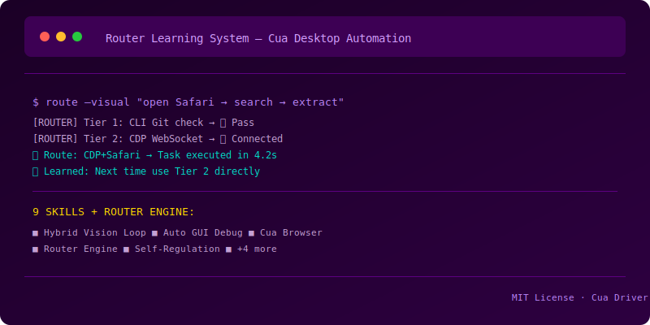
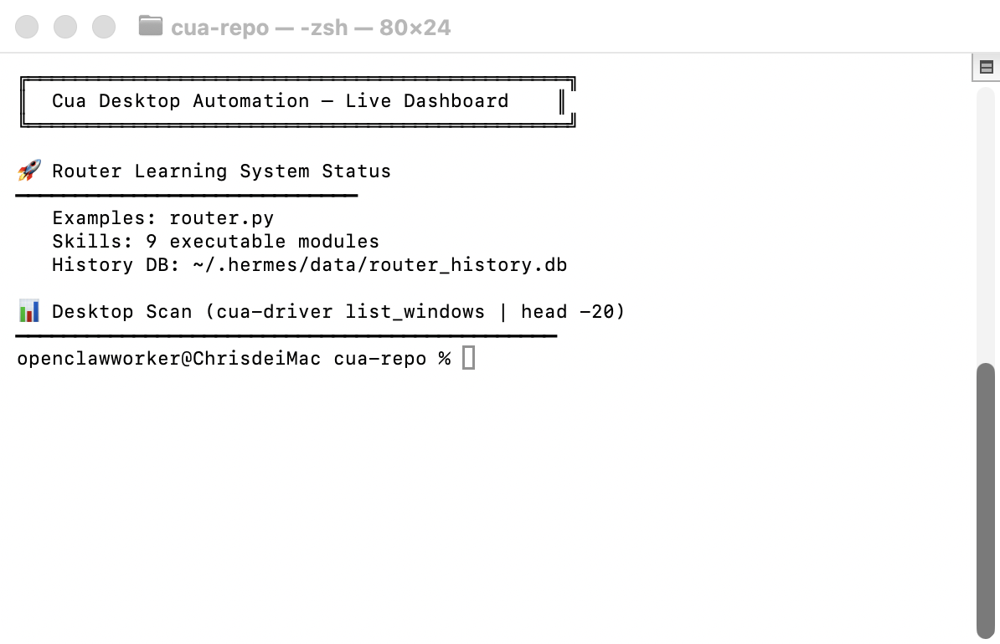

# cua-desktop-automation-skills

<div align="center">

[](https://github.com/ChrisLamDev/cua-desktop-automation-skills/stargazers)
[](https://github.com/ChrisLamDev/cua-desktop-automation-skills/forks)
[](https://opensource.org/licenses/MIT)
[](skills/)
[](https://claude.ai)
[](https://openai.com)
[](https://cursor.sh)
[](https://github.com/NousResearch/hermes-agent)

</div>

**Cua Desktop Automation — 9 executable skills with a self-learning task router for reliable macOS GUI automation.**

## 📸 Demo

<div align="center">
  
  <br><br>
  
  <br>
  <em>Cua Desktop Automation live dashboard — Router Learning System scanning macOS desktop with 9 executable skills</em>
</div>

<br>


A collection of battle-tested skills and examples for building computer-use agents that control macOS desktops via Cua Driver — with an intelligent task router that learns from past executions.

## 🌟 Star Feature: Router Learning System

The `examples/router.py` is a self-improving task routing engine that decides **what tool to use** based on past success:

```
Tier 1 — CLI/Git (fastest, no GUI needed)
Tier 2 — CDP WebSocket (direct browser DOM manipulation)
Tier 3 — Cua Driver (pixel clicks, keystrokes, AX tree)
Tier 4 — Vision AI (screenshot analysis for fallback)
```

### How it works

```python
from examples.router import do

# Route + auto-learn — the more you use it, the smarter it gets
result = do("git_commit", args={"message": "feat: ..."})
# → Router checks history, picks best path, records result
```

**Key capabilities:**
- 🧠 **Dynamic path sorting** — reorders tiers by historical success rate + execution time
- 📊 **SQLite history** (`~/.hermes/data/router_history.db`) — persistent learning across sessions
- 🔄 **Context-aware fallback** — auto-escalates through Tier 1 → 2 → 3 → 4 on failure
- ⏭️ **Consecutive failure skip** — skips paths that failed 3+ times in a row
- 🏆 **Cold start → warm** — static tier order initially, self-optimizes after 5+ samples

### Built-in task routes

| Task | Available paths |
|------|----------------|
| `create_github_token` | Device code flow → CDP browser → Safari AX |
| `browser_navigate` | Cua hotkey (Cmd+L) |
| `browser_fill_input` | CDP JS → Cua type_text |
| `browser_click_button` | CDP JS → Cua pixel click |
| `app_hotkey` | Cua hotkey |
| `app_type` | Cua type_text |
| `app_click` | Cua pixel click |
| `app_screenshot` | screencapture |
| `git_commit` | git CLI |
| `git_push` | git CLI |

## Skills

| Skill | What it does |
|-------|-------------|
| `cua-driver-install-macos` | Install, configure, and integrate Cua Driver on macOS — permission granting, MCP setup, Hermes integration |

## Quick Start

```bash
# Clone
git clone https://github.com/ChrisLamDev/cua-desktop-automation-skills.git
cd cua-desktop-automation-skills

# Try the Router
python3 examples/router.py stats
python3 examples/router.py git_commit
```

## For Cua Driver Contributors

This repo demonstrates real-world patterns for building computer-use agents with Cua Driver:

1. **Task routing with fallback** — the key architectural pattern for reliable desktop automation
2. **Self-learning from history** — essential for production agents that improve over time
3. **Multi-tier escalation** — CLI → CDP → Cua Driver → Vision — handles all failure modes

## Platform Compatibility

- **macOS** (primary target — tested on Apple Silicon)
- Requires Cua Driver: `brew install trycua/tap/cua`

## License

MIT — use freely, improve openly.
